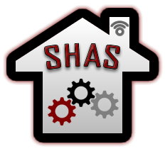

# Smart Home Automation Simulator
A centralized control over an IoT domestic environment.

## Dependencies
 - **SDK:** 1.8
 - **JDK:** 8
 - **Libraries:**
   - Simple-JSON 3.0.3
   - Jython 2.7.0

## Apparatuses
The following appliances or fixtures are available in the automation:
 - Refrigerator

### Refrigerator
The refrigerator is a continuously running appliance. Old refrigerators dating from the 1980's have around 4 cooling cycles. However, according to the analysis by (Issi, 2018), modern refrigerators consume as follows in a 24-hour period:
 - Two defrosting cycles, each lasting 15 minutes using 280 WpH.
 - Intervals of cooling processes lasting over 13 hours (each cycle separated every hour) using 35 WpH.
The refrigerator compressor rests when the refrigeration temperature is below the maximum temperature or while processing a defrost cycle.

## Inspirations
 - [Garadget](https://www.garadget.com/) Garage door wireless control.
 - [Hunter Douglas](https://www.hunterdouglas.com/) Motorized window covers.
 - [Heatmiser](https://www.heatmiser.com/) Thermostats for radiators and floor heating.
 - [Philips Hue](https://www2.meethue.com/) Dimmable and color ambient light bulbs.
 - [Miele Developer](https://www.miele.com/developer/) General home connected appliances.
 - [Nest](https://nest.com/) Thermostats, cameras, doorbells, alarms, and other smart devices.
 - [Open Energy Monitor](https://openenergymonitor.org/) Energy efficiency monitoring systems.
https://developer.samsung.com/smart-home
 - [Sony Developer](https://developer.sony.com/develop/audio-control-api/) Audio controller interface.
 - https://www.apple.com/au/shop/accessories/all-accessories/homekit

## References
 - [Fireworks Export Extension](http://fireworks.abeall.com/extensions/commands/Export/): used for exporting PNG to SVG.